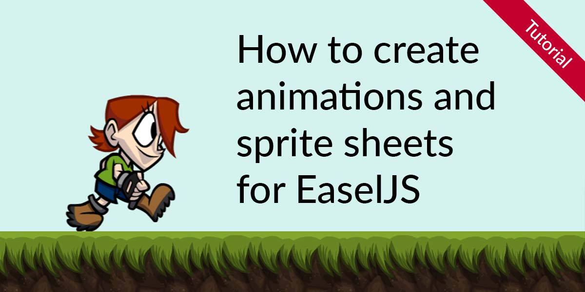

# How to use sprite sheets with EaselJS / CreateJS

Source code for the <a href="https://www.codeandweb.com/texturepacker/tutorials/how-to-create-sprite-sheets-and-animations-for-easeljs-createjs">How to create animations and sprite sheets for EaselJS / CreateJS</a> tutorial.

In this tutorial you are going to learn how to ...

* create sprite sheets for EaselJS/CreateJS
* load assets using PreloadJS
* use animations from a sprite sheet
* set/edit pivot points visually
* optimize your sprite sheet for fast downloads

